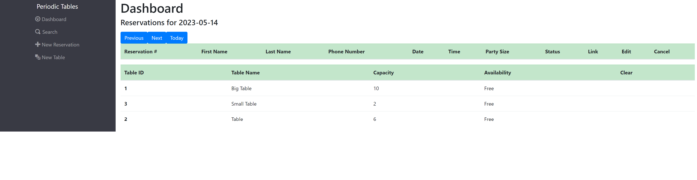

# Capstone: Restaurant Reservation System

This Restaurant Reservation Management application was designed for fine dining restaurants. The software is used only by restaurant personnel when a customer calls to request a reservation. Users can create, edit, view, and cancel reservations as well as manage table seating assignments. 

Customers will not be able to access the system online, at this point.

## Deployed Application
[Frontend Depoloyment](https://restaurant-frontend-kbnj.onrender.com)

[Backend Deployment](https://restaurant-backend-tzun.onrender.com)

## Technology Used
#### Frontend:
- Javascript, React, HTML, CSS, Bootstrap
#### Backend:
-Node.js, Express, Knex, PostgreSQL
## Screenshots
### Dashboard

### Create a new reservation

### Create New Table

### Edit Reservation

### Seat Reservation

### Search Reservation

### Finish Reservation

## API Documentation
Use the following routes for the API:
The API allows for the following routes:

| Method | Route                                  | Description                              |
| ------ | -------------------------------------- | ---------------------------------------- |
| `GET`  | `/reservations`                        | List all reservations for current date   |
| `GET`  | `/reservations?date=YYYY-MM-DD`        | List all reservations for specified date |
| `POST` | `/reservations`                        | Create new reservation                   |
| `GET`  | `/reservations/:reservation_id`        | List reservation by ID                   |
| `PUT`  | `/reservations/:reservation_id`        | Update reservation                       |
| `PUT`  | `/reservations/:reservation_id/status` | Update reservation status                |

| `GET` | `/tables` | List all tables
| `POST` | `/tables` | Create new table
| `PUT` | `/tables/:table_id/seat` | Assign a table to a reservation (changes reservation's `status` to "seated")
| `DELETE` | `/tables/:table_id/seat` | Remove reservation from a table (changes reservation's `status` to "finished")

## Installation

1. Fork and clone this repository.
1. Run `cp ./back-end/.env.sample ./back-end/.env`.
1. Update the `./back-end/.env` file with the connection URL's to your ElephantSQL database instance.
1. Run `cp ./front-end/.env.sample ./front-end/.env`.
1. You should not need to make changes to the `./front-end/.env` file unless you want to connect to a backend at a location other than `http://localhost:5001`.
1. Run `npm install` to install project dependencies.
1. Run `npm run start:dev` to start your server in development mode.

## Application User Stories

  ### US-01 Create and list reservations

As a restaurant manager 
I want to create a new reservation when a customer calls 
so that I know how many customers will arrive at the restaurant on a given day.

### US-02 Create reservation on a future, working date

As a restaurant manager 
I only want to allow reservations to be created on a day when we are open 
so that users do not accidentally create a reservation for days when we are closed. 

### US-03 Create reservation within eligible timeframe

As a restaurant manager 
I only want to allow reservations to be created during business hours, up to 60 minutes before closing 
so that users do not accidentally create a reservation for a time we cannot accommodate.

### US-04 Seat reservation

As a restaurant manager,  
When a customer with an existing reservation arrives at the restaurant 
I want to seat (assign) their reservation to a specific table 
so that I know which tables are occupied and free.

### US-05 Finish an occupied table

As a restaurant manager 
I want to free up an occupied table when the guests leave 
so that I can seat new guests at that table. 

### US-06 Reservation Status

As a restaurant manager 
I want a reservation to have a status of either booked, seated, or finished 
so that I can see which reservation parties are seated, and finished reservations are hidden from the dashboard.

### US-07 Search for a reservation by phone number

As a restaurant manager 
I want to search for a reservation by phone number (partial or complete) 
so that I can quickly access a customer's reservation when they call about their reservation. 

### US-08 Change an existing reservation

As a restaurant manager 
I want to be able to modify a reservation if a customer calls to change or cancel their reservation 
so that reservations are accurate and current.

### Frontend test timeout failure

Running the frontend tests on a resource constrained computer may result in timeout failures.

If you believe your implementation is correct, but needs a bit more time to finish, you can update the `testTimeout` value in `front-end/e2e/jest.config.js`. A value of 10000 or even 12000 will give each test a few more seconds to complete.